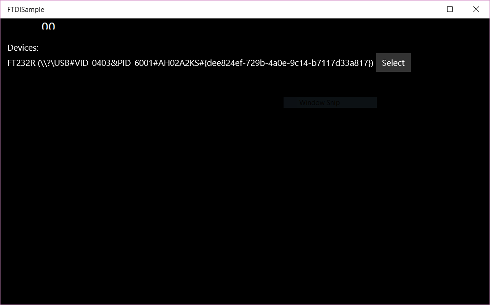
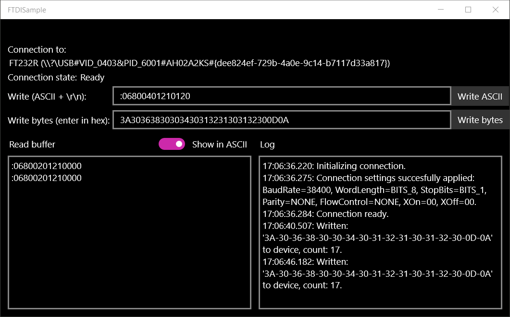

** Note: the ftdi driver installation has stopped working as of version 10556.0 **

# FTDI sample for Windows Universal (UWP)

A sample application showcasing the FTDI D2XX driver use in Windows Universal projects (UWP). This sample is tested on the Raspberry PI 2 with Windows IOT installed and a FTDI FT232R usb-to-serial adapter.

This project uses the D2XX Windows RT driver from FTDI, see http://www.ftdichip.com/Drivers/D2XX.htm for the licensing and liability terms.

## Screenshots




## Installing the FTDI D2XX drivers on the Raspberry PI

1. go to `\\[device-name]\c$\windows\system32`, login with username: `[device-name]\administrator` and the administrator password
2. copy [ftdi.d2xx.winrt.cat](lib/D2xx WinRT 1.0.2/driver/ftdi.d2xx.winrt.cat) and [FTDI.D2xx.WinRT.inf](lib/D2xx WinRT 1.0.2/driver/FTDI.D2xx.WinRT.inf) from [lib\D2xx WinRT 1.0.2\driver](lib/D2xx WinRT 1.0.2/driver) to the folder above
3. start a remote powershell (as administrator) session to the Raspberry PI: 
  - start the remote service: `net start WinRM`
  - add the Raspberry PI to the TrustedHosts if you haven't already: `set-Item WSMan:\localhost\Client\TrustedHosts -Value [device-name]`
  - start the session with:  `enter-pssession -computername [device-name] -credential [device-name]\administrator` this can take up to 30 seconds or more, so be patient
5. type `cd c:\windows\system32` to go to the folder where the drivers are located
4. install the FTDI D2XX driver using the following command: `devcon.exe dp_add FTDI.D2xx.WinRT.inf`
5. reboot the device: `shutdown /r /t 0`
6. when rebooted reconnect again using last part of step 3
5. test the driver is working with: `devcon status "USB\VID_0403&PID_6001"`, it should say something along the lines of:

 ```
 USB\VID_0403&PID_6001\AH02A2KS
    Name: FT232R USB UART
    Driver is running.
 1 matching device(s) found.
 ```
 
 **Note: the VID and PID need to match the model you are using, if you see `0 matching device(s) found.` your FTDI device might use a different VID/PID . For an overview of the default VIDs/PIDS per model see the `DeviceCapability` section in: [Package.appxmanifest](src/FTDISample/Package.appxmanifest) or look up the Hardware Id in the device manager on Windows.**

## Limitations

- if you pull the usb adapter from the Raspberry PI the app will crash
- Toggling ASCII / hex output mode doesn't immediately switch but only after the next change to the read buffer
- there is no cancellation support in the read task, so if the device errors the device will most likely lock up 

## Setting up a new Windows Universal project using the D2XX
**Note: you don't need to execute these instructions if you want to try the sample, this is just for a *new* project.**

1. download the ARM Windows RT drivers http://www.ftdichip.com/Drivers/D2XX.htm (or look in the lib folder of this repository)
2. copy `FTDI.D2xx.WinRT.USB.winmd`, `FTDI.D2xx.WinRT.winmd`, `FTDI.D2xx.WinRT.XML` to your lib folder
3. in your new project add references to the files above
4. open the `Package.appxmanifest` file and make sure the `Capabilities` node has the following sub node:
```xml
<DeviceCapability Name="usb">
  <!--FT232AM, FT232BM, FT232R and FT245R Devices-->
  <Device Id="vidpid:0403 6001">
    <Function Type="name:vendorSpecific" />
  </Device>
  <!--FT2232D and FT2232H Devices-->
  <Device Id="vidpid:0403 6010">
    <Function Type="name:vendorSpecific" />
  </Device>
  <!--FT4232H Device-->
  <Device Id="vidpid:0403 6011">
    <Function Type="name:vendorSpecific" />
  </Device>
  <!--FT232H Device-->
  <Device Id="vidpid:0403 6014">
    <Function Type="name:vendorSpecific" />
  </Device>
  <!--FT-X-Series Devices-->
  <Device Id="vidpid:0403 6015">
    <Function Type="name:vendorSpecific" />
  </Device>
  <!--My Custom Device-->
  <!--<Device Id="vidpid:1234 4321">
      <Function Type="name:vendorSpecific" />
    </Device>-->
</DeviceCapability> 
```
See the sample for how to use the library, more sample code can be found in the download from the FTDI site:  http://www.ftdichip.com/Drivers/D2XX.htm
